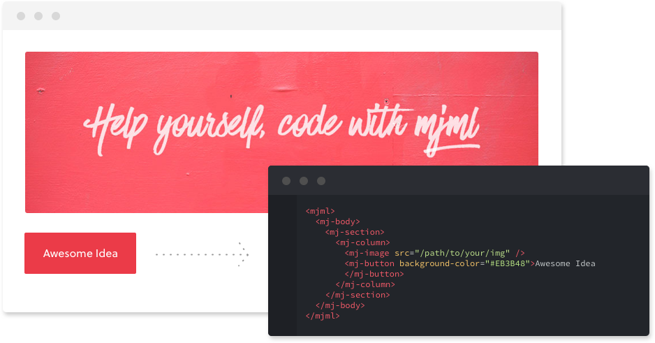

# Responsive E-Mails with Vue.js and mjml rendered on the server

A colleague recently introduced me to [mjml](https://mjml.io/), a framework that makes responsive emails easy.
If you ever had to create emails in plain HTML/CSS that look good on *all* clients, you know the hustle.



Obviously, we still need some additional templating to replace some dynamic parts. 
Vue.js's templating syntax has always been very enjoyable.

I also found a [blog post](https://medium.com/@terencebezman/progressive-emails-using-vue-mjml-947c7764abd3) saying that Vue.js + mjml is a great combination, it does lack some code samples, though.

I wanted to leverage the [Vue-Server-Renderer](https://ssr.vuejs.org/) for this.

The idea is simple:

* Render the Vue templates using the Vue-Server-Renderer
* Render the previous output using mjml2html

This way, we can combine the power of Vue.js and mjml.
Enough talking, let's get into the code.

-----

## Dependencies

Install the dependencies

```sh
yarn add vue vue-server-renderer mjml
```

## Render a simple template on the server

Let's start by rendering a simple vue component.

```js
const Vue = require('vue')

const app = new Vue({
    template: `<span>hello</span>`
})

const renderer = require('vue-server-renderer').createRenderer()

renderer.renderToString(app).then(html => {
  console.log(html)
}).catch(err => {
  console.error(err)
})
```

Executing the code above (`node <filename>.js`) will output

> `<span data-server-rendered="true">hello</span>`

# Render a template with data

Now, let's pass in some data to that component and interpolate it to the template.

```js
const Vue = require('vue')

const app = new Vue({
    data: {
        name: 'kevcodez'
    },
    template: `<span>hello {{ name }}</span>`
})

const renderer = require('vue-server-renderer').createRenderer()

renderer.renderToString(app).then(html => {
  console.log(html)
}).catch(err => {
  console.error(err)
})
```

> `<span data-server-rendered="true">hello kevcodez</span>`

# Render templates with mjml

Rather than using plain html tags, we can use the mjml tags.
`mjml2html` is used to convert the markup to actual HTML.

```js
const Vue = require('vue')
const mjml2html = require('mjml')

const app = new Vue({
    data: {
        name: 'kevcodez'
    },
    template: `
<mjml>
  <mjml-body>
    <mj-section>
      <mj-column>
          <mj-text font-size="20px" color="#F45E43" font-family="helvetica">Hello {{ name }}</mj-text>
      </mj-column>
    </mj-section>
  </mjml-body>
</mjml>`
})

const renderer = require('vue-server-renderer').createRenderer()

renderer.renderToString(app).then(html => {
  // Two properties (html/errors), errors being an array of error messages that occured during template rendering
  const htmlAndErrors = mjml2html(html)
  console.log(htmlAndErrors.html)
}).catch(err => {
  console.error(err)
})
```

This will now output something like

```html
<!doctype html>
<html xmlns="http://www.w3.org/1999/xhtml" xmlns:v="urn:schemas-microsoft-com:vml" xmlns:o="urn:schemas-microsoft-com:office:office">
    ...
</html>
```

## Wrapping template for the server renderer

The Vue-Server-Renderer allows us to pass in a template, that wraps around the rendered Vue component.

```js
const renderer = require('vue-server-renderer').createRenderer({
    template: `<mjml>
    <mj-body>
    <!--vue-ssr-outlet-->
    </mj-body>
    </mjml>`
})
```

`<!--vue-ssr-outlet-->` is the placeholder that will get replaced with the rendered component.
By doing that, we don't have to define the base mjml-tags in every component.

If you have a look at the data object returned by `mjml2html`, you will see that we have an error

```js
[
  {
    line: 3,
    message: 'Attribute data-server-rendered is illegal',
    tagName: 'mj-section',
    formattedMessage: 'Line 3 of C:\\Private\\test-mjml (mj-section) — Attribute data-server-rendered is illegal'
  }
]
```

The vue-server-renderer automatically attached the attribute `data-server-rendered` to the markup.
Easiest way to get rid of it is replace that attribute before rendering.

## Complete example

Full example to render Vue.js templates with mjml on the server:

```js
const mjml2html = require('mjml')
const Vue = require('vue')

const app = new Vue({
    data: {
        name: 'kevcodez'
    },
    template: `
<mj-section>
  <mj-column>
    <mj-text font-size="20px" color="#F45E43" font-family="helvetica">Hello {{ name }}</mj-text>
  </mj-column>
</mj-section>`
})

const renderer = require('vue-server-renderer').createRenderer({
    template: `
<mjml>
  <mj-body>
    <!--vue-ssr-outlet-->
  </mj-body>
</mjml>`
})

renderer.renderToString(app).then(html => {
    const htmlWithoutDataServerRenderedAttribute = html.replace(`data-server-rendered="true"`, '')
    const plainHtml = mjml2html(htmlWithoutDataServerRenderedAttribute)
    console.log(plainHtml.html)
})
```

mjml supports a few options to modify the output (i.e. minify/beautify/fonts).
Check out the [Github Readme](https://github.com/mjmlio/mjml) for the options.

We could now build a simple API that receives some data to dynamically render response email templates and send them to our users.

Source code on [Github](https://github.com/kevcodez/vuejs-server-renderer-mjml).

If you like this post, feel free to follow me or hit me up on [Twitter](https://twitter.com/kevcodez).