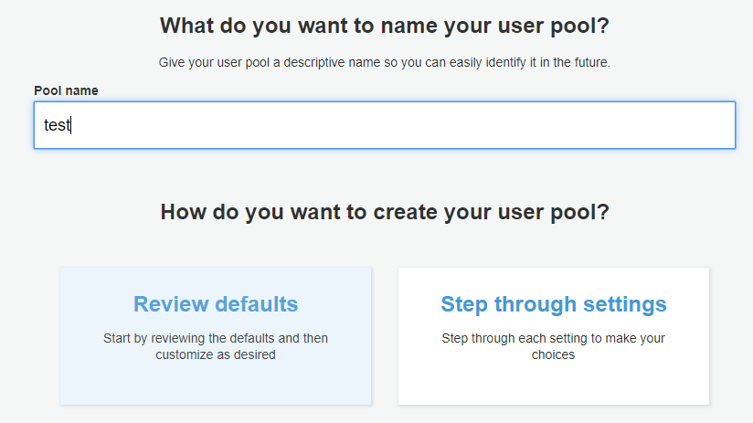
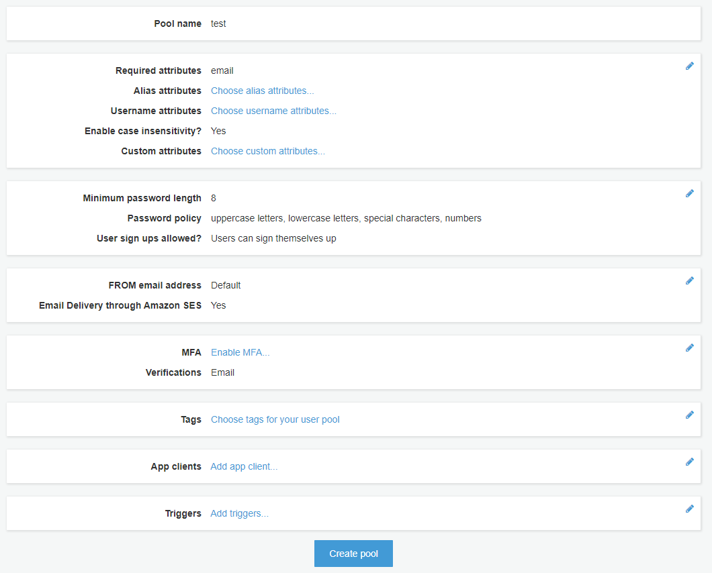
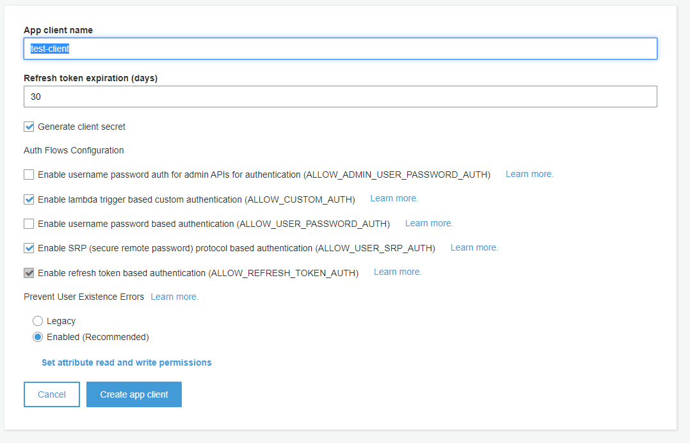
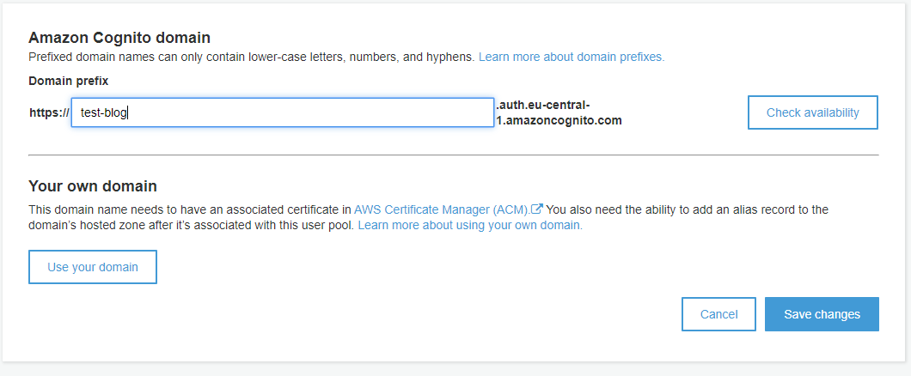
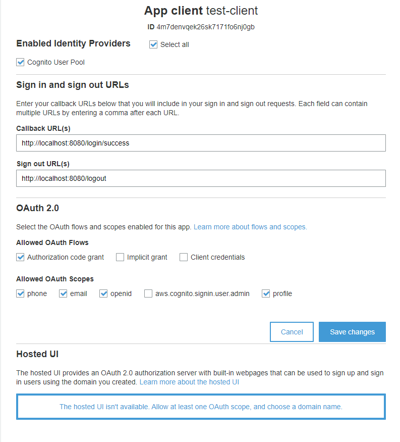
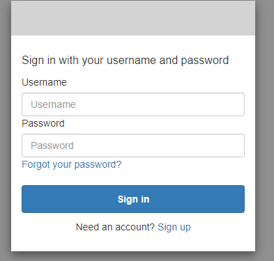

# Getting started with AWS Cognito

Let's get started on [AWS Cognito](https://aws.amazon.com/cognito/).

> Amazon Cognito lets you add user sign-up, sign-in, and access control to your web and mobile apps quickly and easily. Amazon Cognito scales to millions of users and supports sign-in with social identity providers, such as Facebook, Google, and Amazon, and enterprise identity providers via SAML 2.0.

A few features:

* Customizable ready-to-use login screens
* OpenId Connect, OAuth 2.0 and SAML 2.0 support
* Built-in support for Facebook, Google, Amazon and Apple login
* Add any SAML/OpenID Connect identity provider
* Multi-Factor authentication support

First **50,000** monthly active users are *free*.

## Setup Cognito

To setup cognito, we need to navigate login to the AWS management console and create a new user pool.

### Create user pool

For ease of setup, we'll go with the defaults.

### Create groups

After creating the pool, navigate to users/groups.

Let's create two groups.
"admin" and "user".

### Create user

We'll also create a user so we can test the login.

If you run into password constraint issues, you can change that now or later in the **Policies** tab.

### Assign group to user

Click on the user and assign the user to the "user" group.

### Creating app client

To be able to login or provide a login page, we still need to create an app client.
Go to General **Settings > App Clients** and create a new client.

### Configure domain

To use the hosted UI, we need to setup a domain under **App integration / Domain name**.

Amazon provides a domain for us if we simply define a unique subdomain.
You can use your own domain aswell.

### Configure an app client

App clients are disabled by default.
We need to go to **App integration > App client settings**, enable the identity provider and define a callback url.

For Authorization flows you can either choose Authorization code grant and/or Implicit grant **OR** Client credentials.
An app client cannot support client credentials and authorization code grant flow.
You need separate clients.

You should now be able to launch the hosted UI.

We should be able to login with our recently created user and be redirected to http://<redirect-url>?code=... on successful login.
